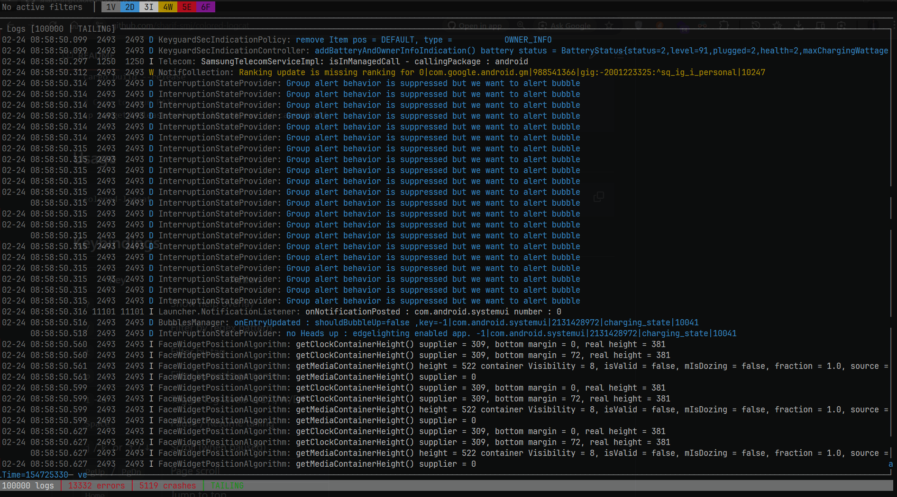

# colored-logcat

A blazing-fast TUI for Android logcat, built in Rust.


## Why?

Agentic coding is on the rise. With the accuracy of AI models like Claude, Codex, GLM and others improving rapidly, a full IDE is no longer necessary at all times. Android Studio is memory-intensive and bulky — but until now, its logcat viewer was the only usable option for Android development.

Enter **colored-logcat**: a terminal-native TUI that brings all the Android Studio logcat functionality — color-coded levels, filtering, crash monitoring, JSON highlighting — without the bulk. Pair it with your AI coding agent and a lightweight editor, and you have everything you need.



## Features

- **Color-coded log levels** — Verbose, Debug, Info, Warn, Error, Fatal each get distinct colors
- **Interactive filtering** — regex pattern, tag, and package name filters with live input
- **Level toggles** — enable/disable individual log levels with `1`-`6` keys
- **Package filtering** — filter by app package name with automatic PID resolution
- **JSON syntax highlighting** — detects JSON in log messages and colorizes keys, strings, numbers, booleans
- **Scrollback & freeze** — pause the stream, scroll through history, resume tailing
- **Multi-panel layout** — split view with crash/ANR panel or device list sidebar
- **Export** — save filtered logs to a timestamped file
- **Crash monitoring** — dedicated panel for crashes, ANRs, and fatal errors
- **Tiny footprint** — ~1.6MB release binary, 250k entry ring buffer by default

## Requirements

- [ADB](https://developer.android.com/tools/adb) on your PATH
- An Android device connected via USB with USB debugging enabled

## Installation

```bash
# Clone and build
git clone https://github.com/sharif-smj/colored-logcat.git
cd colored-logcat
cargo build --release

# Copy to your PATH
cp target/release/colored-logcat.exe ~/.cargo/bin/
```

## Usage

```bash
colored-logcat
```

Optional: set a larger/smaller in-memory buffer (clamped between 10k and 2M).

```bash
# PowerShell
$env:COLORED_LOGCAT_MAX_ENTRIES="500000"
colored-logcat
```

## Keybindings

| Key | Action |
|-----|--------|
| `h` / `?` | Toggle command help panel |
| `/` | Filter by regex pattern |
| `t` | Filter by tag |
| `p` | Filter by package name |
| `1`-`6` | Toggle log levels V/D/I/W/E/F |
| `Space` | Pause / Resume tailing |
| `j`/`k` or `↑`/`↓` | Scroll (when paused) |
| `PgUp` / `PgDn` | Page scroll |
| Mouse wheel | Scroll logs (scroll up pauses tailing) |
| Right click | Jump to bottom / resume tail |
| `Home` | Jump to top |
| `End` / `G` | Jump to bottom / resume tailing |
| `x` | Toggle crash/ANR panel |
| `d` | Toggle device panel |
| `s` | Save visible logs to file |
| `c` | Clear logcat buffer |
| `Esc` | Clear filters / cancel input |
| `q` / `Ctrl+C` | Quit |

## License

MIT
